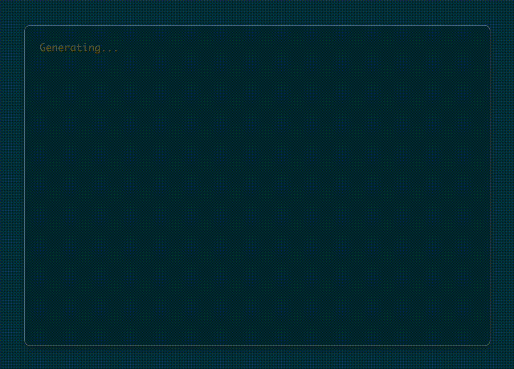

# React Text Stream

A React library for streaming text using Server-Sent Events (SSE) with `text/event-stream`. This library provides both a React component and a custom hook for handling real-time text streaming.

## Demo



## Installation

```bash
npm install react-text-stream
```

## Features

- 🚀 **React Component**: Exports an easy-to-use `ReactTextStream` component
- 🎣 **Custom Hook**: Exports a custom `useTextStream` hook for complex use-cases
- ⚛️ **React Hooks**: Built with native hooks like `useSyncExternalStore` for optimal rendering performance
- 📡 **Server-Sent Events**: Built on native [EventSource](https://developer.mozilla.org/en-US/docs/Web/API/EventSource) Web API
- 🔄 **Auto-retry**: Automatic reconnection with retry logic
- 📦 **TypeScript**: Full TypeScript support
- 🎨 **Customizable**: Flexible rendering and event handling

## Usage

### ReactTextStream Component

The `ReactTextStream` component provides a simple way to display streaming text:

```tsx
import React from 'react'
import { ReactTextStream } from 'react-text-stream'

function App() {
  return (
    <ReactTextStream 
      url="http://localhost:3001/sse" 
      onEvent={(event) => event.type === 'completed' ? undefined : `${event.word ?? ''} `}
      render={(stream) => (<div>{stream}</div>)}
    />
  )
}
```

#### Props

- `url` (string): The SSE endpoint URL
- `onEvent` (function): Event handler that processes incoming events and returns a string or undefined. Caution: A return value of undefined will close the keep-alive connection and terminate the event stream. 
- `render` (function): Render function that receives the accumulated stream and returns React element

### useTextStream Hook

For complex rendering scenarios, use the `useTextStream` hook:

```tsx
import React from 'react'
import { useTextStream } from 'react-text-stream'

function CustomStreamComponent() {
  const stream = useTextStream(
    'http://localhost:3001/sse', 
    (event: { type: string, word: string }): string|undefined => {
      switch (event.type) {
        case 'chunk':
          return `${event.word} `;
        case 'completed':
          return undefined;
        default:
          return '';
      }
    },
  )!;

  return (
    <div>
      {stream?.length > 0 ? String(stream) : 'Generating...'}
    </div>
  )
}
```

#### Parameters

- `url` (string): The SSE endpoint URL
- `onEvent` (function): Event handler that processes incoming events and returns a string or undefined. Caution: A return value of undefined will close the keep-alive connection and terminate the event stream. 

#### Returns

- `stream` (string | undefined): The accumulated stream content

## Event Handling

The `onEvent` function receives events from the SSE stream and should return:

- **string**: Content to append to the stream
- **undefined**: Signal to close the connection and stop streaming

### Example Event Types

```tsx
// Handle different event types
const handleEvent = (event: { type: string, word: string }): string|undefined => {
  switch (event.type) {
    case 'chunk':
      return `${event.word} `;  // Append word with space
    case 'completed':
      return undefined;         // Stop streaming
    case 'error':
      return 'Error occurred';  // Handle errors
    default:
      return '';               // Ignore unknown events
  }
}
```

## Server-Side Setup

Your SSE endpoint should send events in this format:

```javascript
// Express.js example
app.get('/sse', (req, res) => {
  res.writeHead(200, {
    'Content-Type': 'text/event-stream',
    'Cache-Control': 'no-cache',
    'Connection': 'keep-alive',
  });

  // Send streaming data
  const words = ['Hello', 'world', 'from', 'SSE'];
  
  words.forEach((word, index) => {
    setTimeout(() => {
      res.write(`data: ${JSON.stringify({ type: 'chunk', word })}\n\n`);
      
      if (index === words.length - 1) {
        res.write(`data: ${JSON.stringify({ type: 'completed' })}\n\n`);
        res.end();
      }
    }, index * 1000);
  });
});
```

## Error Handling

The library includes automatic retry logic:

- **Connection errors**: Automatically retries up to 3 times
- **Event parsing**: Gracefully handles malformed JSON
- **Connection closure**: Properly cleans up resources

## TypeScript Support

The library is fully typed. You can define custom event types:

```tsx
interface CustomEvent {
  type: 'chunk' | 'completed' | 'error';
  word?: string;
  metadata?: any;
}

const stream = useTextStream<CustomEvent>(
  'http://localhost:3001/sse',
  (event: CustomEvent): string|undefined => {
    // Handle typed events
  })
);
```

## Development

```bash
# Install dependencies
npm install

# Build the library
npm run build

# Watch for changes during development
npm run dev
```

## License

MIT

## Author

Alek Merani
